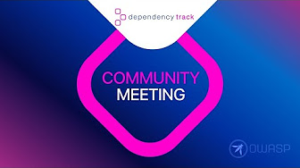

# OWASP Dependency-Track Community

## Community Meetings

Community meetings take place *every 1st Wednesday of the month, at 4PM UTC*.

Current meeting details, including agenda and connection information, can be found in the [OWASP Software Supply Chain Community Calendar](https://calendar.google.com/calendar/u/0/embed?src=c_884decde5a152902bb51a62f89550d0f3748484534f08c63792f2e654f2a7ebc@group.calendar.google.com&ctz=UTC).

Community meetings are recorded, and recordings are uploaded to YouTube within one or two days.
A playlist with all previous meeting recordings can be found here:

<https://www.youtube.com/playlist?list=PLQhgERhSEs97X4LRC_wc4Z3Sr9soAayJR>

Slide decks used during the meetings are available in the [`community-meetings`](community-meetings) directory of this repository.
